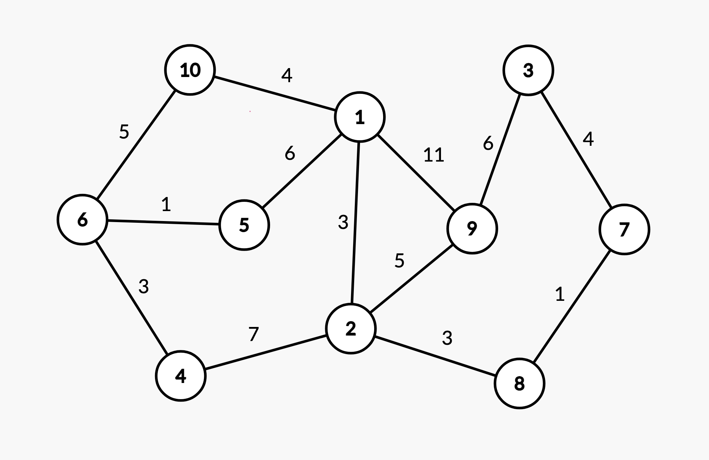

# Práctica 2: Búsqueda heurística sin adversa-rios

El propósito de esta práctica es que el alumno reutilice código que implementa el algoritmo A*. Se bajará código de Github, y lo utilizará para ejecutar este algoritmo para un grafo concreto.

## Problema a resolver: Algoritmo A*

### Pasos a realizar

En primer lugar, debe bajarse de Github el código de algoritmos y estructuras de datos en Java de Justin Wetherell:

``` bash
 git clone https://github.com/phishman3579/java-\algorithms-implementation.git
```

A continuación, examine el código de la clase AStar.java, más concretamente, el método aStar. Luego, examine los tests del A* que hay en:

``` bash
java-algorithms-implementation/test/com/jwetherell/algorithms/graph/test/Graphs.java
```

Después, de forma gradual, desarrolle la clase principal donde estará el programa de la práctica. Comience con un código sencillo:

``` java
 package aplicacion;

 public class Main {
     public static void main(String[] args) {
         System.out.println("Esto es una prueba");
     }
 }
```

Es muy importante que no olvide la línea

``` java
 package aplicacion;
 ```

Para poderlo compilar y ejecutar sin necesidad de crear ningún proyecto en un IDE (p.ej. Netbeans), modifique el fichero

``` xml
<span title="Para entender el papel de los fichero build.xml en Java y el uso de ant se recomienda que consulte el manual de Apache accesible a través de la siguiente dirección"><a href="https://ant.apache.org/manual/tutorial-HelloWorldWithAnt.html">build.xml</a></span>
```

 de la siguiente forma.

En la zona indicada por

``` xml
 <!– set global properties for this build –>
```

, se debe añadir la siguiente línea de código:

``` xml
<property name="main-class" value="aplicacion.Main"/>
```

El target de dist también se debe modificar para que quede de la siguiente manera:

```xml
<target name="dist" depends="build" description="generate the distribution">
   <jar jarfile="${dist}/java-algorithms-implementation-${DSTAMP}.jar"basedir="${build}">
       <manifest>
           <attribute name="Main-Class" value="${main-class}"/>
       </manifest>
   </jar>
</target>
```

Luego, se añade:

```xml
<target name="run_main" depends="dist">
   <java jar="${dist}/java-algorithms-implementation-${DSTAMP}.jar"fork="true"/>
</target>
```

A continuación se comprueba que el programa funciona:

``` bash
ant run_main
```

Tomando como referencia los tests, se crea un programa principal que genere un camino aplicando A*.

### Implementación

Primero, usamos la clase _UndirectedGraph_ para generar un grafo no dirigido que nos va servir para aplicar el algoritmo A*.

``` java
private static class UndirectedGraph {
        final List<Vertex<Integer>> verticies = new ArrayList<Vertex<Integer>>();
        final Graph.Vertex<Integer> v1 = new Graph.Vertex<Integer>(1);
        final Graph.Vertex<Integer> v2 = new Graph.Vertex<Integer>(2);
        final Graph.Vertex<Integer> v3 = new Graph.Vertex<Integer>(3);
        final Graph.Vertex<Integer> v4 = new Graph.Vertex<Integer>(4);
        final Graph.Vertex<Integer> v5 = new Graph.Vertex<Integer>(5);
        final Graph.Vertex<Integer> v6 = new Graph.Vertex<Integer>(6);
        final Graph.Vertex<Integer> v7 = new Graph.Vertex<Integer>(7);
        final Graph.Vertex<Integer> v8 = new Graph.Vertex<Integer>(8);
        final Graph.Vertex<Integer> v9 = new Graph.Vertex<Integer>(9);
        final Graph.Vertex<Integer> v10 = new Graph.Vertex<Integer>(10);
        {
            verticies.add(v1);
            verticies.add(v2);
            verticies.add(v3);
            verticies.add(v4);
            verticies.add(v5);
            verticies.add(v6);
            verticies.add(v7);
            verticies.add(v8);
            verticies.add(v9);
            verticies.add(v10);
        }

        final List<Edge<Integer>> edges = new ArrayList<Edge<Integer>>();
        final Graph.Edge<Integer> e1_2 = new Graph.Edge<Integer>(3, v1, v2);
        final Graph.Edge<Integer> e1_5 = new Graph.Edge<Integer>(6, v1, v5);
        final Graph.Edge<Integer> e1_9 = new Graph.Edge<Integer>(11, v1, v9);
        final Graph.Edge<Integer> e1_10 = new Graph.Edge<Integer>(4, v1, v10);
        final Graph.Edge<Integer> e2_4 = new Graph.Edge<Integer>(7, v2, v4);
        final Graph.Edge<Integer> e2_8 = new Graph.Edge<Integer>(3, v2, v8);
        final Graph.Edge<Integer> e3_7 = new Graph.Edge<Integer>(11, v3, v7);
        final Graph.Edge<Integer> e3_9 = new Graph.Edge<Integer>(2, v3, v9);
        final Graph.Edge<Integer> e4_6 = new Graph.Edge<Integer>(3, v4, v6);
        final Graph.Edge<Integer> e5_6 = new Graph.Edge<Integer>(1, v5, v6);
        final Graph.Edge<Integer> e6_10 = new Graph.Edge<Integer>(5, v6, v10);
        final Graph.Edge<Integer> e8_7 = new Graph.Edge<Integer>(1, v8, v7);
        final Graph.Edge<Integer> e9_2 = new Graph.Edge<Integer>(5, v9, v2);
        {
            edges.add(e1_2);
            edges.add(e1_5);
            edges.add(e1_9);
            edges.add(e1_10);
            edges.add(e2_4);
            edges.add(e2_8);
            edges.add(e3_7);
            edges.add(e3_9);
            edges.add(e4_6);
            edges.add(e5_6);
            edges.add(e6_10);
            edges.add(e8_7);
            edges.add(e9_2);
        }

        final Graph<Integer> graph = new Graph<Integer>(verticies, edges);
    }
```

El código anterior representa el grafo siguente:



Desde la clase _Main_ implementamos en el método _main_ la llamada a _aStar_ con el grafo que generamos previamente.

``` java
    public static void main(String[] args){
        UndirectedGraph test_graph = new UndirectedGraph(); // UndirectedGraph object
        AStar<Integer> algorithm_aStar = new AStar<Integer>(); 
        List<Graph.Edge<Integer>> solution_path = algorithm_aStar.aStar(test_graph.graph, test_graph.v6, test_graph.v7);
        System.out.println(solution_path);
    }
```

## Ejecución

Para poder ejecutar el programa puedes apoyarte de un IDE o de la libreria _ant_.

Para instalar la libreria, usar el siguiente comando:

``` bash
brew install ant
```

Y ejecutar desde la carpeta _java-algorithms-implementation_ con:

``` bash
ant run_main
```

En la terminal se debe obtener el camino optimo para llevar desde un vertice del grafo a otro:


Representación del camino optimo obtenido:


## Preguntas

A continuación, responda a las siguientes preguntas:

### 1.- ¿Qué variable representa la lista ABIERTA?

La representación de la lista ABIERTA dentro del método aStar es una variale tipo ArrayList, con el nombre: **_openSet_**.

Su implementación dentro del código:

``` java
final List<Graph.Vertex<T>> openSet = new ArrayList<Graph.Vertex<T>>(size); // The set of tentative nodes to be evaluated, initially containing the start node
openSet.add(start);
```
La lista ABIERTA inicialmente contiene el nodo inicial y los nodos provisionales a evaluar.

### 2.- ¿Qué variable representa la función g?

La función g, dentro del método aStar, está representada por la variable de tipo HashMap, de nombre: **gScore**.

Su implementación dentro del código:

``` java
final Map<Graph.Vertex<T>,Integer> gScore = new HashMap<Graph.Vertex<T>,Integer>(); // Cost from start along best known path.
gScore.put(start, 0);
```
La función g, es el coste del mejor camino desde el nodo inicial a N obtenido hasta el momento durante la búsqueda.

### 3.- ¿Qué variable representa la función f?

La función f, dentro del método aStar, está representada por la variable de tipo HashMap, de nombre: **_fScore_**.

Su implementación dentro del código:

``` java
final Map<Graph.Vertex<T>,Integer> fScore = new HashMap<Graph.Vertex<T>,Integer>();
for (Graph.Vertex<T> v : graph.getVertices())
    fScore.put(v, Integer.MAX_VALUE);
fScore.put(start, heuristicCostEstimate(start,goal));
```

La funcióin f representa el coste del camino más corto, desde el inicio hasta los objetivos condicionado a pasar por el nudo N.

### 4.- ¿Qué método habría que modificar para que la heurística representarala distancia aérea entre vértices?

Para representar la distancia aérea entre vértices habria que modificar el método: **_heuristicCostEstimate_**.

``` java
/**
* Default heuristic: cost to each vertex is 1.
*/
 @SuppressWarnings("unused") 
protected int heuristicCostEstimate(Graph.Vertex<T> start, Graph.Vertex<T> goal) {
    return 1;
}
```

Actualmente en la implementación de aStar se utiliza para inicializar los valores de la función f y retorna un 1.

``` java
fScore.put(start, heuristicCostEstimate(start,goal));
```

Y para calcular el costo estimado de la función f.

``` java
final int estimatedFScore = gScore.get(neighbor) + heuristicCostEstimate(neighbor, goal);
fScore.put(neighbor, estimatedFScore);
```

### 5.- ¿Realiza este método reevaluación de nudos cuando se encuentra una nueva ruta a un determinado vértice? Justifique la respuesta.

El método para realizar la reevaluación de nudos es: **_reconstructPath_**.

``` java
private List<Graph.Edge<T>> reconstructPath(Map<Graph.Vertex<T>,Graph.Vertex<T>> cameFrom, Graph.Vertex<T> current) {
        final List<Graph.Edge<T>> totalPath = new ArrayList<Graph.Edge<T>>();

        while (current != null) {
            final Graph.Vertex<T> previous = current;
            current = cameFrom.get(current);
            if (current != null) {
                final Graph.Edge<T> edge = current.getEdge(previous);
                totalPath.add(edge);
            }
        }
        Collections.reverse(totalPath);
        return totalPath;
    }
```

**_reconstructPath_**, retorna el camino que se recorre. Sin embargo, las evaluaciones se hacen dentro del propio método **_aStar_**, como se puede observar en:

``` java
         while (!openSet.isEmpty()) {
            final Graph.Vertex<T> current = openSet.get(0);
            if (current.equals(goal))
                return reconstructPath(cameFrom, goal);

            openSet.remove(0);
            closedSet.add(current);
            for (Graph.Edge<T> edge : current.getEdges()) {
                final Graph.Vertex<T> neighbor = edge.getToVertex();
                if (closedSet.contains(neighbor))
                    continue; // Ignore the neighbor which is already evaluated.

                final int tenativeGScore = gScore.get(current) + distanceBetween(current,neighbor); // length of this path.
                if (!openSet.contains(neighbor))
                    openSet.add(neighbor); // Discover a new node
                else if (tenativeGScore >= gScore.get(neighbor))
                    continue;

                // This path is the best until now. Record it!
                cameFrom.put(neighbor, current);
                gScore.put(neighbor, tenativeGScore);
                final int estimatedFScore = gScore.get(neighbor) + heuristicCostEstimate(neighbor, goal);
                fScore.put(neighbor, estimatedFScore);

                // fScore has changed, re-sort the list
                Collections.sort(openSet,comparator);
            }
        }
```

Con las variables **_tenativeGScore_** o **_estimatedFScore_**.
